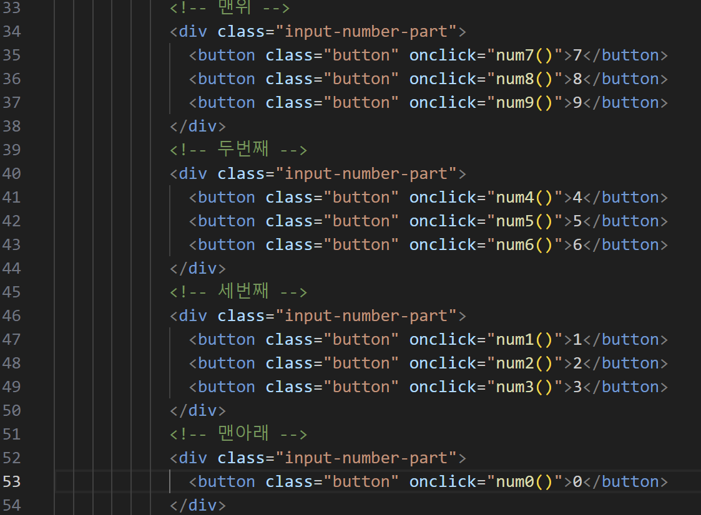
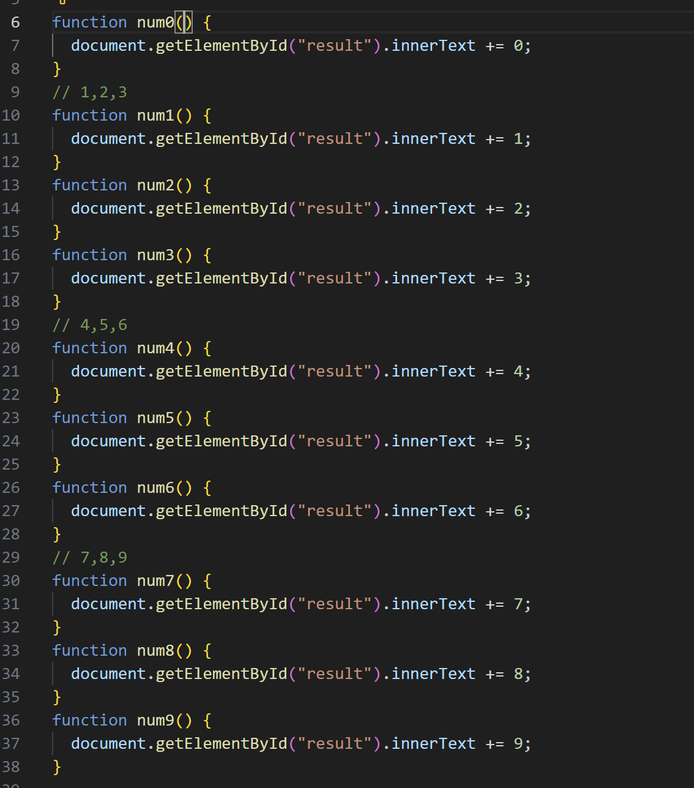
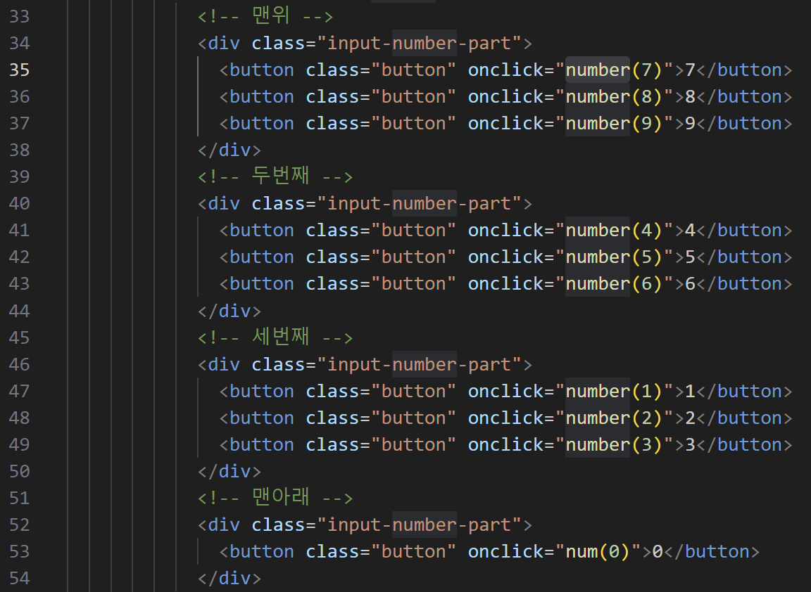
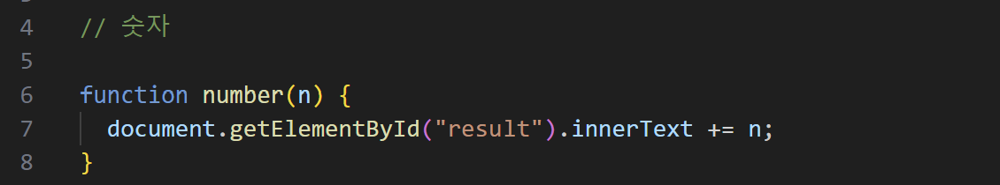

# 프로젝트 6번

javascript의 기초 문법.
javascript의 DOM 조작.

## 기획

### 기본 문법의 이해

- 변수 선언 (var, let, const)
- 기초 연산자
- 조건문
- 반복문
- 함수

### DOM 조작의 이해

- getElementById()
- addEventListener()
- input과 .value로 데이터 가져오기
- event 조작

## 개선

- BEFORE

기능 구현에만 몰두해서 코드의 가독성을 고려하지 못함.

- AFTER

함수를 재활용 가능하게 중복을 제거함.

기존에 **32줄**이었던 코드를 **3줄로 생략**하여 가독성을 높였음.
